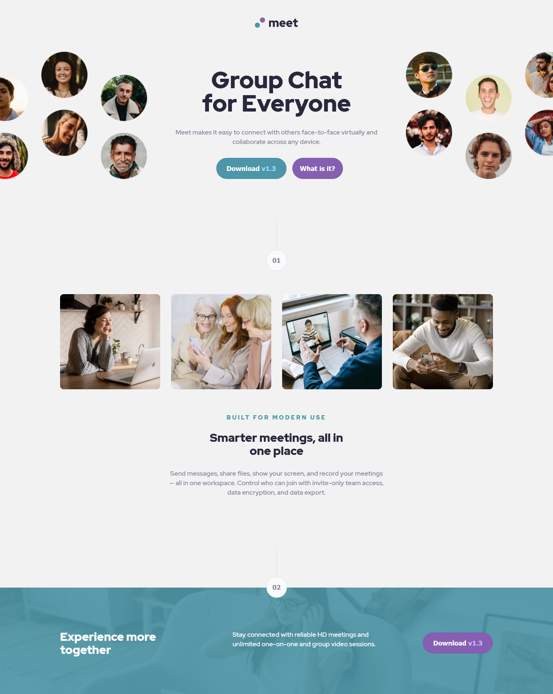

# Frontend Mentor - Meet landing page solution

This is a solution to the [Meet landing page challenge on Frontend Mentor](https://www.frontendmentor.io/challenges/meet-landing-page-rbTDS6OUR).
Frontend Mentor challenges help you improve your coding skills by building realistic projects.

## Table of contents

- [Overview](#overview)
  - [The challenge](#the-challenge)
  - [Screenshot](#screenshot)
  - [Links](#links)
- [My process](#my-process)
  - [Built with](#built-with)
  - [What I learned](#what-i-learned)
  - [Continued development](#continued-development)
  - [Useful resources](#useful-resources)
- [Author](#author)
- [Acknowledgments](#acknowledgments)

## Overview

### The challenge

Users should be able to:

- View the optimal layout depending on their device's screen size
- See hover states for interactive elements

### Screenshot



### Links

- Solution URL: [Add solution URL here](https://github.com/nicheweb-frontend-challenges/meet-landing-page.git)
- Live Site URL: [Add live site URL here](https://musing-raman-ba7ea5.netlify.app/)

## My process

### Built with

- Semantic HTML5 markup
- CSS custom properties
- Flexbox
- CSS Grid
- Mobile-first workflow

### What I learned

Actually I felt really comfortable building this project, the technique I used to get the blending in the footer was by far the most complicated of this challenge and then the positioning of the page number over the footer's head using calc(). I should say that I struggled finding the right breakpoints, currently I am not happy with the breakpoints I got.

```html
<footer class="footer">
  <div class="page-number-wrapper">
    <div class="vertical-line"></div>
    <button class="page-number"><p>02</p></button>
  </div>
  <div class="call-to-action blending">
    <h2>Experience more together</h2>
    <p>
      Stay connected with reliable HD meetings and unlimited one-on-one and
      group video sessions.
    </p>
    <button class="download" type="button" name="button">
      <p>Download <span>v1.3</span></p>
    </button>
  </div>
</footer>
```

```css
.footer {
  background-image: url("/image-footer.jpg");
  background-blend-mode: saturation;
  background-repeat: no-repeat;
  background-size: cover;
  position: relative;
}
.call-to-action {
  background-color: rgba(77, 150, 168, 0.9);
}
.footer .page-number-wrapper {
  position: absolute;
  left: calc(50% - 28px);
  bottom: calc(100% - 28px);
}
```

### Continued development

Looking for continue developing my skills, trying to consult less to get basic things done. Still my code need some refactoring mainly on the style, and a lot of comments. Ah! also have to make my dimensions more responsive. That's all for now. See you.

### Useful resources

- [RGB and RGBA values](https://developer.mozilla.org/en-US/docs/Learn/CSS/Building_blocks/Values_and_units) - This helped me to get the footer done using rgba(). I really liked this pattern.

## Author

- Website - [Norge Rojas Cerulia](I am improving my website it gonna get ready soon)
- Frontend Mentor - [@niche-web](https://www.frontendmentor.io/profile/niche-web)
- Twitter - [@@Nani45670378](https://www.twitter.com/@Nani45670378)

## Acknowledgments

Thank you to MDN.
